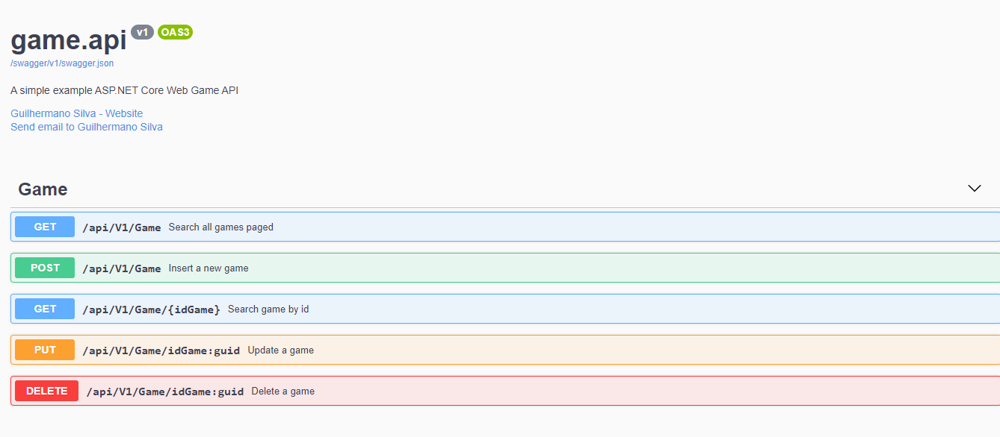

# API de cadastro de jogos

       

Api de cadastro de jogos desenvolvida com ASP.NET Core 5.0 e MS SQL Server. 
Esse projeto foi criado no Bootcampo Takeblip com a plataforma da Digital Innovation One.

## Foi utilizado neste projeto:
 * Camada de Entidade;
 * Separação de **InputModel** e **ViewModel**;
 * Padrão **Repository**;
 * Injeção de dependência;
 * Versionamento de API;
 * Paginação de listagem de produtos;
 * Swagger como documentação dos endpoints;

